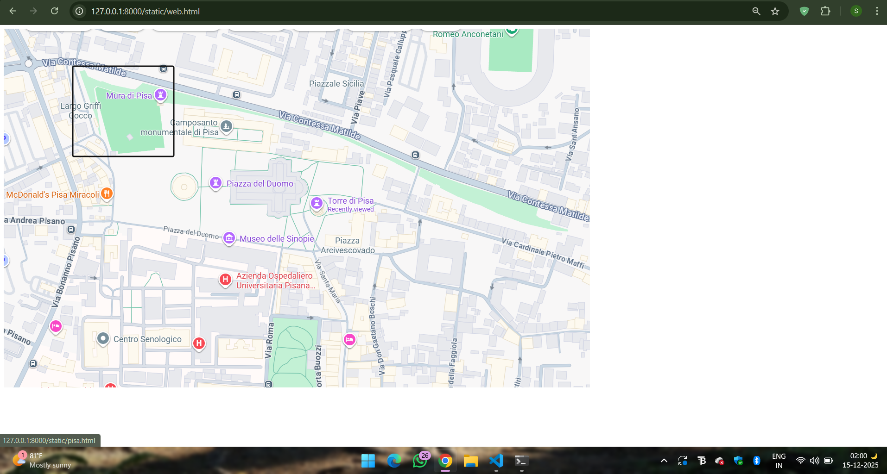
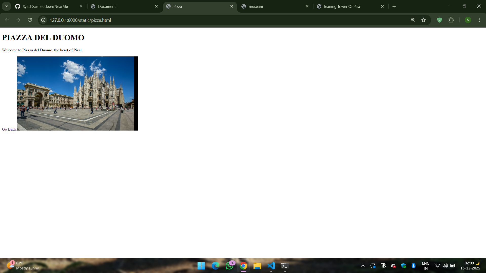
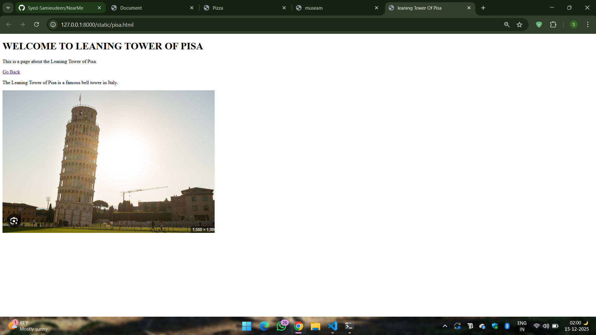

# Ex04 Places Around Me
## Date: 15-12-2025

## AIM
To develop a website to display details about the places around my house.

## DESIGN STEPS

### STEP 1
Create a Django admin interface.

### STEP 2
Download your city map from Google.

### STEP 3
Using ```<map>``` tag name the map.

### STEP 4
Create clickable regions in the image using ```<area>``` tag.

### STEP 5
Write HTML programs for all the regions identified.

### STEP 6
Execute the programs and publish them.

## CODE
```
<!DOCTYPE html>
<html lang="en">
<head>
    <meta charset="UTF-8">
    <meta name="viewport" content="width=device-width, initial-scale=1.0">
    <title>Document</title>
</head>
<body>
        <!-- Image Map Generated by http://www.image-map.net/ -->
    

    <map name="image-map">
        <area target="" alt="pisa.html" title="pisa" href="pisa.html" coords="149,81,367,276" shape="rect">
        <area target="" alt="muse.html" title="muse" href="muse.html" coords="449,424,690,508" shape="rect">
        <area target="" alt="pizza.html" title="pizza" href="pizza.html" coords="434,303,807,413" shape="rect">
    </map>
</body>
</html>
<!DOCTYPE html>
<html lang="en">
<head>
    <meta charset="UTF-8">
    <meta name="viewport" content="width=device-width, initial-scale=1.0">
    <title>leaning Tower Of Pisa</title>
</head>
<body>
    <H1>WELCOME TO LEANING TOWER OF PISA</H1>
    <p>This is a page about the Leaning Tower of Pisa.</p>
    <a href="web.html">Go Back</a>
    <p>The Leaning Tower of Pisa is a famous bell tower in Italy.</p>
    
</body>
</html>
<!DOCTYPE html>
<html lang="en">
<head>
    <meta charset="UTF-8">
    <meta name="viewport" content="width=device-width, initial-scale=1.0">
    <title>museam</title>
</head>
<body>
    <h1>MUSEO DELLE SINOPIE</h1>
    <p>Welcome to the Museo delle Sinopie, where you can explore the fascinating underdrawings of frescoes!</p>
    <a href="web.html">Go Back</a>
    
</body>
</html>
<!DOCTYPE html>
<html lang="en">
<head>
    <meta charset="UTF-8">
    <meta name="viewport" content="width=device-width, initial-scale=1.0">
    <title>Pizza</title>
</head>
<body>
    <h1>PIAZZA DEL DUOMO</h1>
    <p>Welcome to Piazza del Duomo, the heart of Pisa!</p>
    <a href="web.html">Go Back</a>
    
</body>
</html>
```

## OUTPUT







## RESULT
The program for implementing image maps using HTML is executed successfully.
